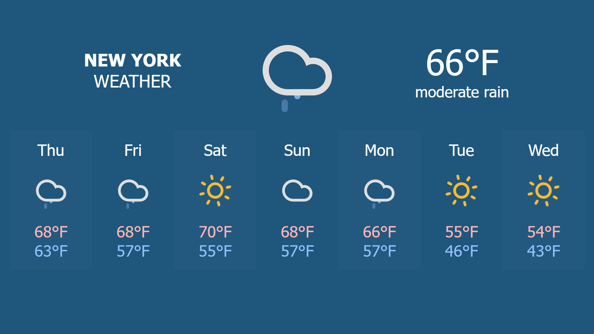

# Weather Display
Simple live weather display for a dedicated monitor. Intended to be run 24/7 on a low-spec computer, like a Raspberry Pi.



## Setup

These are suggestions for how you might setup this display.

### Generic Setup
1. Setup your computer. Ensure it has a desktop environment.
2. Establish an internet connection.
3. Install a web browser. This will render the weather display.
4. Setup a local web server and have it run on startup.
5. Clone this repository into the web server's public directory.
6. Go to [weatherwidget.io](https://weatherwidget.io/), set your location, set your labels, customize the widget however you'd like, select *GET CODE*, then *COPY TO CLIPBOARD*.
7. In `weatherdisplay.html`, replace whatever is in the `<body>...</body>` tags with the code you copied in (6).
8. Make sure everything displays properly on `localhost` in your browser of choice. Adjust the browser zoom for the weather display to fit your monitor. Take note of the URL.
9. Have the URL from (8) load in the browser of choice on startup, in fullscreen.
10. Reboot your computer and check that the weather display loads as expected.

### Raspberry Pi 1 Model B Setup

These instructions will likely work with other Raspberry Pi models as well.

#### Setup hardware

Install Raspberry Pi OS onto a SD card with at least 4GB. This has been tested on Raspberry Pi OS Bullseye (2022-09-22 release).

Attach either an ethernet connection or a USB WiFi dongle. Ensure the device connects to the internet.

Ensure the device boots directly to the desktop by default.

#### Install dependencies

Run the following:
```bash
sudo apt install nginx unclutter xautomation epiphany-browser
```

#### Setup a local server

After installing `nginx`, it should be enabled to run on boot. We'll now configure this server to host our weather display. Run the following:
```bash
cd /var/www/html
git clone https://github.com/jcbrockschmidt/weather-display.git
```

You should now be able to access `http://localhost/weather-display` in a browser.

**NOTE:** This site will be visible to everyone on your LAN network. If this is a security concern, configure `iptables` to block incoming HTTP traffic.

#### Configure the browser

Open `epiphany-browser` and go to `http://localhost/weather-display`.

Adjust the zoom to fit your preference. Fullscreen the browser beforehand as this is how the site will be displayed.

Disable tab restore. This will prevent additional tabs from being loaded if the device isn't shutdown gracefully. Open Preferences by clicking the drop-down menu in the upper right and selecting *Preferences*. Under *Session*, select *Start in Incognito Mode*. For some reason, disabling *Restore Tabs on Startup* doesn't always do what it says. Incognito mode solves this issue.

#### Load display on startup

Create the script `displayweather.sh` in `/home/pi`. Put this in it:
```bash
#!/usr/bin/bash

# Disable DPMS (Display Power Management Signaling)
xset -dpms
# Disable screen saver
xset s off
# Do not blank the video device
xset s noblank

# Hide mouse
unclutter &
# Wait for desktop environment initialize somewhat
sleep 60s
# Load weather display
epiphany-browser "http://localhost/weather-display" --display=:0 &
# Wait for epiphany-browser to load
sleep 180s
# Make weather display fullscreen
xte "key F11" -x:0
```

Now open `/etc/xdg/lxsession/LXDE-pi/autostart` or `~/.config/lxsession/LXDE-pi/autostart` in an editor as root. At the end of the file, add this line:
```
@/home/pi/displayweather.sh
```

#### Test it

Reboot the Raspberry Pi and make sure everything loads as expected. The weather display should load by itself in fullscreen, without a visible address bar, and without a mouse showing.


It may take up to 10-15 minutes to fully load, so give it time before deciding to debug. If everything loads, let it sit for a few hours and see if it updates properly and doesn't go into sleep mode. You may also want to test that it loads properly after the power has been cut off abruptly.


## Credit
This display uses the weather widget from [weatherwidget.io](https://weatherwidget.io/).
